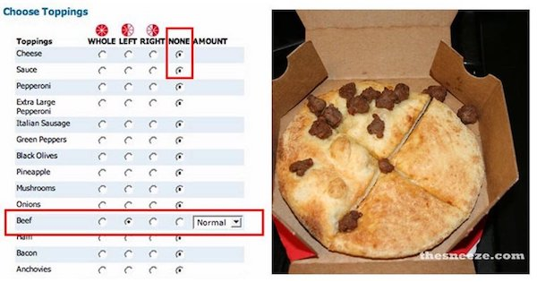

# 

## Credit

Based on [cat-pad](https://github.com/sindresorhus/cat-pad/)
Inspired by the stupidity that is [left-pad](https://www.theregister.co.uk/2016/03/23/npm_left_pad_chaos/)
all the hilarious [left-pad npm modules](https://www.npmjs.com/search?q=left%20pad)
and this stupid [meme](http://knowyourmeme.com/memes/special-delivery-instructions)

## Install

```
$ npm install --save none-padding-with-left-beef
```


## Usage

```js
const nonePaddingWithLeftBeef = require('cat-pad');

nonePaddingWithLeftBeef('Mooooo');
//=> '🐄Mooooo'
```


## API

### nonePaddingWithLeftBeef(input)

Puts a cow to the left of `input`.

#### input

Type: `string`

String to place a cow in front of.


## License

MIT © [Ian Norden]
